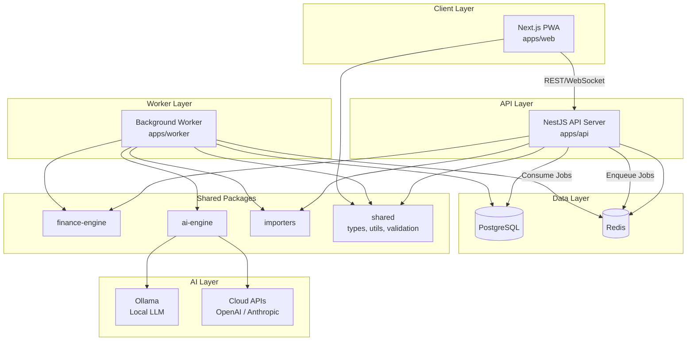
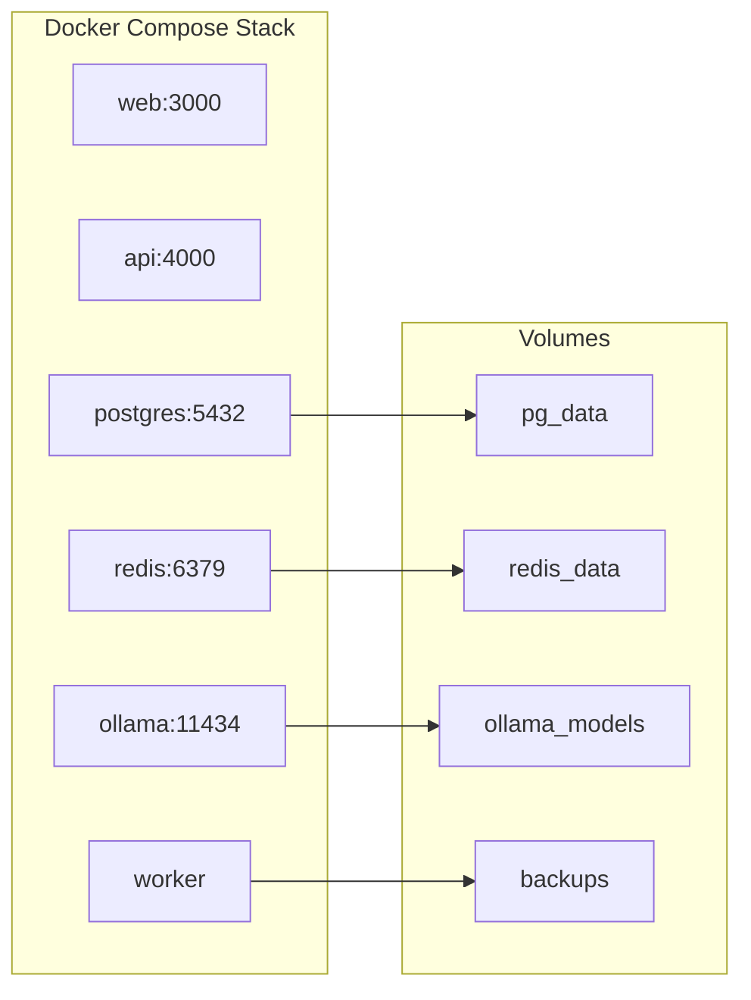
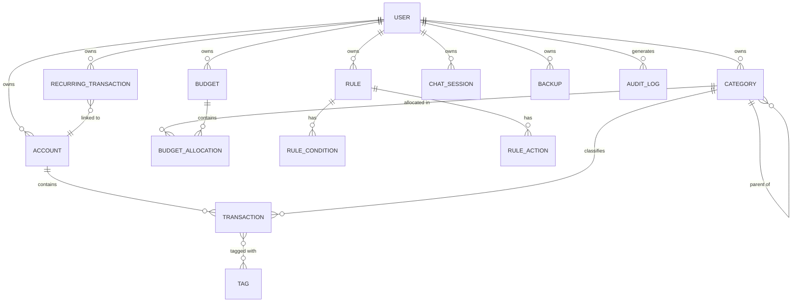

# Design Document: AI Personal Finance App

## Overview

This document defines the technical design for a self-hostable, AI-powered personal finance application. The system follows a monorepo architecture with clear separation between a Next.js frontend (PWA), a NestJS API backend, background workers for async processing, and shared packages for business logic.

**Core Design Principle:** AI is never the source of truth. The Finance Engine (deterministic math) handles all calculations — balances, forecasts, debt schedules, and budgets. The AI Engine explains, categorizes, summarizes, detects patterns, and suggests actions. When AI produces numerical claims, the Finance Engine independently verifies them.

**Technology Stack:**
- **Frontend:** Next.js 14+ with React, TypeScript, Tailwind CSS, PWA (service worker + manifest)
- **Backend:** NestJS with TypeScript, Prisma ORM, Passport.js (auth)
- **Database:** PostgreSQL 15+ with NUMERIC(19,4) for currency precision
- **Cache/Queue:** Redis 7+ with BullMQ for job queues
- **AI:** Ollama (local LLM) + optional OpenAI/Anthropic cloud APIs
- **Worker:** NestJS standalone application consuming BullMQ jobs
- **Deployment:** Docker Compose with named volumes, health checks
- **Monorepo:** Turborepo for build orchestration

## Architecture

### High-Level System Architecture



### Monorepo Structure

```
budgetapp/
├── apps/
│   ├── web/                  # Next.js frontend (PWA)
│   ├── api/                  # NestJS API server
│   └── worker/               # Background job processor
├── packages/
│   ├── shared/               # Types, validation schemas, constants
│   ├── finance-engine/       # Deterministic math (balances, forecasts, debt)
│   ├── ai-engine/            # AI abstraction layer (Ollama + cloud)
│   ├── importers/            # CSV/OFX/QFX parsers
│   └── connectors/           # Future: bank API connectors
├── prisma/                   # Database schema and migrations
├── docker/                   # Dockerfiles per service
├── docker-compose.yml
├── turbo.json
└── package.json
```

### Request Flow Patterns

**Synchronous (user-facing):**
```
PWA → API → Finance Engine → PostgreSQL → Response
```

**Asynchronous (background processing):**
```
API → Redis Queue → Worker → AI Engine → PostgreSQL → Notification
```

**AI-verified response:**
```
PWA → API → AI Engine → AI Response
                ↓
          Finance Engine (verify) → Corrected Response → PWA
```

### Deployment Architecture



## Components and Interfaces

### 1. Frontend (apps/web)

**Responsibilities:**
- Render UI with responsive layouts (320px–2560px)
- Service worker for offline caching and action queuing
- PWA manifest for installability
- Client-side state management (React Query + Zustand)
- WebSocket connection for real-time notifications

**Key Modules:**
| Module | Purpose |
|--------|---------|
| `pages/` | Next.js routes (dashboard, accounts, transactions, budget, debt, chat) |
| `components/` | Reusable UI components |
| `hooks/` | Custom React hooks for data fetching and state |
| `workers/service-worker.ts` | Offline caching, action queue (max 100) |
| `lib/api-client.ts` | Typed HTTP client to API |
| `lib/sync-manager.ts` | Offline queue sync with last-write-wins conflict resolution |

**Offline Strategy:**
- Cache app shell + last-fetched data (7-day TTL)
- Queue mutations (max 100 actions)
- On reconnect: flush queue within 30s, last-write-wins on conflicts
- Notify user of auto-resolved conflicts

### 2. API Server (apps/api)

**Responsibilities:**
- Authentication and session management
- REST API endpoints for all features
- Request validation and rate limiting
- Job enqueueing for async operations
- WebSocket gateway for real-time notifications

**NestJS Module Structure:**
```
apps/api/src/
├── auth/              # AuthModule: login, register, sessions, password reset
├── accounts/          # AccountModule: CRUD, balance calculation
├── transactions/      # TransactionModule: CRUD, search, pagination, duplicates
├── categories/        # CategoryModule: CRUD, merge, sub-categories
├── budgets/           # BudgetModule: CRUD, progress tracking
├── rules/             # RulesModule: CRUD, dry-run, retroactive apply
├── import/            # ImportModule: file upload, preview, commit
├── ai-chat/           # AIChatModule: query handling, verification
├── debt/              # DebtModule: calculator strategies
├── cashflow/          # CashFlowModule: forecast generation
├── recurring/         # RecurringModule: detection, management
├── backup/            # BackupModule: create, restore, schedule
├── settings/          # SettingsModule: AI privacy mode, preferences
├── notifications/     # NotificationModule: WebSocket gateway
├── health/            # HealthModule: endpoint for Docker health checks
└── common/            # Guards, interceptors, filters, decorators
```

**Key Interfaces:**

```typescript
// Auth
POST   /api/auth/login          → { token, expiresAt }
POST   /api/auth/register       → { user }
POST   /api/auth/logout         → void
POST   /api/auth/forgot-password → void
POST   /api/auth/reset-password  → void

// Accounts
GET    /api/accounts            → Account[]
POST   /api/accounts            → Account
PATCH  /api/accounts/:id        → Account
DELETE /api/accounts/:id        → void (archive)
GET    /api/accounts/net-worth  → { assets, liabilities, netWorth }

// Transactions
GET    /api/transactions        → { data: Transaction[], meta: PaginationMeta }
POST   /api/transactions        → Transaction
PATCH  /api/transactions/:id    → Transaction
DELETE /api/transactions/:id    → void
GET    /api/transactions/duplicates → DuplicateGroup[]

// Import
POST   /api/import/upload       → { preview: Transaction[], fileId }
POST   /api/import/commit       → ImportSummary
GET    /api/import/mappings     → ColumnMapping[]

// Categories
GET    /api/categories          → Category[] (tree structure)
POST   /api/categories          → Category
PATCH  /api/categories/:id      → Category
DELETE /api/categories/:id      → void
POST   /api/categories/merge    → void

// Budgets
GET    /api/budgets/:month      → Budget
POST   /api/budgets             → Budget
PATCH  /api/budgets/:id         → Budget
POST   /api/budgets/copy        → Budget
GET    /api/budgets/:month/summary → BudgetSummary

// Rules
GET    /api/rules               → Rule[]
POST   /api/rules               → Rule
PATCH  /api/rules/:id           → Rule
DELETE /api/rules/:id           → void
POST   /api/rules/:id/dry-run  → DryRunResult
POST   /api/rules/:id/apply    → { affected: number }

// AI Chat
POST   /api/chat                → ChatResponse
GET    /api/chat/history        → ChatMessage[]

// Debt Calculator
POST   /api/debt/calculate      → DebtSchedule
POST   /api/debt/compare        → StrategyComparison
POST   /api/debt/what-if        → DebtSchedule

// Cash Flow
GET    /api/cashflow/forecast   → CashFlowForecast
POST   /api/cashflow/one-time   → void

// Recurring
GET    /api/recurring           → RecurringTransaction[]
POST   /api/recurring/confirm   → void
POST   /api/recurring/dismiss   → void
GET    /api/recurring/detected  → DetectedPattern[]

// Backup
POST   /api/backup/create       → { backupId, downloadUrl }
POST   /api/backup/restore      → void
GET    /api/backup/list         → BackupMeta[]
PATCH  /api/backup/schedule     → void

// Settings
GET    /api/settings            → UserSettings
PATCH  /api/settings            → UserSettings
POST   /api/settings/validate-api-key → { valid: boolean }

// Health
GET    /api/health              → { status, services: Record<string, 'up'|'down'> }
```

### 3. Background Worker (apps/worker)

**Responsibilities:**
- Process BullMQ job queues
- AI categorization batches
- Recurring transaction detection
- Scheduled backups
- Import processing for large files
- Notification dispatch

**Queue Definitions:**
| Queue Name | Job Types | Concurrency |
|------------|-----------|-------------|
| `ai-categorization` | Batch categorize uncategorized transactions | 1 |
| `import-processing` | Parse and commit large import files | 2 |
| `recurring-detection` | Analyze transaction history for patterns | 1 |
| `backup` | Create/schedule encrypted backups | 1 |
| `rules-apply` | Retroactive rule application | 2 |
| `notifications` | Deliver in-app notifications | 5 |

### 4. Finance Engine (packages/finance-engine)

**Responsibilities:**
- All deterministic math: balances, budget sums, debt amortization, cash-flow projections
- Uses `Decimal.js` for arbitrary-precision arithmetic (no floating-point errors)
- Pure functions with no side effects — fully testable
- Verifies AI-generated numerical claims

**Key Interfaces:**

```typescript
interface FinanceEngine {
  // Balance
  calculateBalance(initialBalance: Decimal, transactions: Transaction[]): Decimal;
  calculateNetWorth(accounts: Account[]): NetWorthSummary;

  // Budget
  calculateBudgetProgress(allocations: Allocation[], transactions: Transaction[]): BudgetProgress;
  calculateBudgetSummary(budget: Budget, transactions: Transaction[]): BudgetSummary;

  // Debt
  calculatePayoffSchedule(debts: Debt[], strategy: Strategy, extraPayment: Decimal): PayoffSchedule;
  compareStrategies(debts: Debt[], strategies: Strategy[]): StrategyComparison;

  // Cash Flow
  projectCashFlow(account: Account, recurring: RecurringTransaction[], days: number): DailyProjection[];

  // Verification
  verifyAIClaim(claim: NumericalClaim, context: FinancialContext): VerificationResult;
}
```

### 5. AI Engine (packages/ai-engine)

**Responsibilities:**
- Abstract LLM interactions behind a unified interface
- Route requests based on AI Privacy Mode (local/hybrid/cloud)
- Handle categorization prompts, chat queries, and pattern analysis
- Manage confidence scoring for categorization
- Never serve as source of truth for numbers

**Key Interfaces:**

```typescript
interface AIEngine {
  categorize(transaction: TransactionContext): Promise<CategorySuggestion>;
  batchCategorize(transactions: TransactionContext[]): Promise<CategorySuggestion[]>;
  chat(query: string, financialContext: FinancialContext, history: ChatMessage[]): Promise<AIResponse>;
  detectPatterns(transactions: Transaction[]): Promise<PatternInsight[]>;
}

interface AIProvider {
  complete(prompt: string, options: CompletionOptions): Promise<string>;
  isAvailable(): Promise<boolean>;
}

// Provider implementations
class OllamaProvider implements AIProvider { /* local via http://ollama:11434 */ }
class OpenAIProvider implements AIProvider { /* cloud via API key */ }
class AnthropicProvider implements AIProvider { /* cloud via API key */ }
```

**Privacy Mode Routing:**
- **Local:** All requests → OllamaProvider
- **Cloud:** All requests → configured cloud provider (with user consent)
- **Hybrid:** Sensitive data (balances, amounts, account numbers) → OllamaProvider; non-sensitive (general questions, explanations) → cloud provider

### 6. Importers (packages/importers)

**Responsibilities:**
- Parse CSV, OFX, and QFX file formats
- Column mapping for CSV files
- Duplicate detection during import
- Round-trip property: parse → export → re-parse produces matching data

**Key Interfaces:**

```typescript
interface Importer {
  parse(buffer: Buffer, format: 'csv' | 'ofx' | 'qfx', mapping?: ColumnMapping): ParseResult;
  export(transactions: Transaction[], format: 'csv'): Buffer;
  detectDuplicates(incoming: ParsedTransaction[], existing: Transaction[]): DuplicateMatch[];
}

interface ParseResult {
  transactions: ParsedTransaction[];
  errors: ParseError[];      // { line: number, reason: string }
  totalRows: number;
}
```

## Data Models

### Entity Relationship Diagram



### Core Schemas (Prisma)

```prisma
model User {
  id             String    @id @default(uuid())
  email          String    @unique
  passwordHash   String
  createdAt      DateTime  @default(now())
  updatedAt      DateTime  @updatedAt
  failedLogins   Int       @default(0)
  lockedUntil    DateTime?
  
  accounts       Account[]
  categories     Category[]
  budgets        Budget[]
  rules          Rule[]
  sessions       Session[]
  chatSessions   ChatSession[]
  backups        Backup[]
  settings       UserSettings?
  auditLogs      AuditLog[]
}

model Session {
  id          String   @id @default(uuid())
  userId      String
  token       String   @unique
  expiresAt   DateTime
  lastActive  DateTime @default(now())
  user        User     @relation(fields: [userId], references: [id])

  @@index([userId])
  @@index([token])
}

model Account {
  id             String      @id @default(uuid())
  userId         String
  name           String      @db.VarChar(100)
  type           AccountType
  currency       String      @default("USD") @db.VarChar(3)
  initialBalance Decimal     @db.Decimal(19, 4)
  isArchived     Boolean     @default(false)
  createdAt      DateTime    @default(now())
  updatedAt      DateTime    @updatedAt

  user         User          @relation(fields: [userId], references: [id])
  transactions Transaction[]
  recurring    RecurringTransaction[]

  @@unique([userId, name])
  @@index([userId, isArchived])
}

enum AccountType {
  CHECKING
  SAVINGS
  CREDIT_CARD
  LOAN
  MORTGAGE
  HELOC
  CASH
  MANUAL
}

model Transaction {
  id            String          @id @default(uuid())
  userId        String
  accountId     String
  categoryId    String?
  date          DateTime        @db.Date
  amount        Decimal         @db.Decimal(19, 4)
  type          TransactionType
  merchant      String?         @db.VarChar(100)
  description   String?         @db.VarChar(500)
  notes         String?         @db.VarChar(1000)
  isReconciliation Boolean      @default(false)
  aiCategorized Boolean         @default(false)
  aiConfidence  Decimal?        @db.Decimal(3, 2)
  createdAt     DateTime        @default(now())
  updatedAt     DateTime        @updatedAt

  account  Account   @relation(fields: [accountId], references: [id])
  category Category? @relation(fields: [categoryId], references: [id])
  tags     TransactionTag[]

  @@index([userId, accountId, date])
  @@index([userId, categoryId])
  @@index([userId, merchant])
  @@index([accountId, date, amount, merchant]) // duplicate detection
}

enum TransactionType {
  DEBIT
  CREDIT
}

model TransactionTag {
  id            String      @id @default(uuid())
  transactionId String
  tag           String      @db.VarChar(50)

  transaction Transaction @relation(fields: [transactionId], references: [id], onDelete: Cascade)

  @@unique([transactionId, tag])
  @@index([tag])
}

model Category {
  id        String   @id @default(uuid())
  userId    String
  parentId  String?
  name      String   @db.VarChar(50)
  icon      String?  @db.VarChar(50)
  color     String?  @db.VarChar(7) // hex color
  isDefault Boolean  @default(false)
  createdAt DateTime @default(now())

  user         User          @relation(fields: [userId], references: [id])
  parent       Category?     @relation("CategoryHierarchy", fields: [parentId], references: [id])
  children     Category[]    @relation("CategoryHierarchy")
  transactions Transaction[]
  allocations  BudgetAllocation[]

  @@unique([userId, parentId, name])
  @@index([userId])
}

model Budget {
  id        String   @id @default(uuid())
  userId    String
  month     DateTime @db.Date // first day of month
  createdAt DateTime @default(now())
  updatedAt DateTime @updatedAt

  user        User               @relation(fields: [userId], references: [id])
  allocations BudgetAllocation[]

  @@unique([userId, month])
}

model BudgetAllocation {
  id         String  @id @default(uuid())
  budgetId   String
  categoryId String
  amount     Decimal @db.Decimal(19, 4)

  budget   Budget   @relation(fields: [budgetId], references: [id], onDelete: Cascade)
  category Category @relation(fields: [categoryId], references: [id])

  @@unique([budgetId, categoryId])
}

model Rule {
  id          String   @id @default(uuid())
  userId      String
  name        String   @db.VarChar(100)
  priority    Int
  isActive    Boolean  @default(true)
  logic       RuleLogic @default(ALL) // ALL = AND, ANY = OR
  createdAt   DateTime @default(now())
  updatedAt   DateTime @updatedAt

  user       User            @relation(fields: [userId], references: [id])
  conditions RuleCondition[]
  actions    RuleAction[]

  @@index([userId, isActive, priority])
}

enum RuleLogic {
  ALL
  ANY
}

model RuleCondition {
  id       String            @id @default(uuid())
  ruleId   String
  field    RuleConditionField
  operator RuleOperator
  value    String            @db.VarChar(500)

  rule Rule @relation(fields: [ruleId], references: [id], onDelete: Cascade)
}

enum RuleConditionField {
  MERCHANT
  AMOUNT
  DESCRIPTION
}

enum RuleOperator {
  CONTAINS
  EQUALS
  STARTS_WITH
  REGEX
  GREATER_THAN
  LESS_THAN
  BETWEEN
}

model RuleAction {
  id         String         @id @default(uuid())
  ruleId     String
  type       RuleActionType
  value      String         @db.VarChar(500)

  rule Rule @relation(fields: [ruleId], references: [id], onDelete: Cascade)
}

enum RuleActionType {
  SET_CATEGORY
  ADD_TAG
  SET_MERCHANT
  ADD_NOTE
}

model RecurringTransaction {
  id             String            @id @default(uuid())
  userId         String
  accountId      String
  merchant       String            @db.VarChar(100)
  expectedAmount Decimal           @db.Decimal(19, 4)
  frequency      RecurrenceFrequency
  nextExpected   DateTime          @db.Date
  isConfirmed    Boolean           @default(false)
  isDismissed    Boolean           @default(false)
  isActive       Boolean           @default(true)
  createdAt      DateTime          @default(now())

  user    User    @relation(fields: [userId], references: [id])
  account Account @relation(fields: [accountId], references: [id])

  @@index([userId, isActive])
}

enum RecurrenceFrequency {
  WEEKLY
  BIWEEKLY
  MONTHLY
  QUARTERLY
  SEMIANNUAL
  ANNUAL
}

model ChatSession {
  id        String        @id @default(uuid())
  userId    String
  createdAt DateTime      @default(now())
  messages  ChatMessage[]

  user User @relation(fields: [userId], references: [id])

  @@index([userId])
}

model ChatMessage {
  id            String   @id @default(uuid())
  sessionId     String
  role          String   // 'user' | 'assistant'
  content       String   @db.Text // encrypted at application layer
  verifiedData  Json?    // Finance Engine verified numbers
  createdAt     DateTime @default(now())

  session ChatSession @relation(fields: [sessionId], references: [id], onDelete: Cascade)
}

model UserSettings {
  id              String        @id @default(uuid())
  userId          String        @unique
  aiPrivacyMode   AIPrivacyMode @default(LOCAL)
  openaiKey       String?       // encrypted
  anthropicKey    String?       // encrypted
  backupSchedule  BackupSchedule?
  backupPassphrase String?      // encrypted
  backupRetention Int           @default(5)
  sessionTimeout  Int           @default(30) // minutes
  createdAt       DateTime      @default(now())
  updatedAt       DateTime      @updatedAt

  user User @relation(fields: [userId], references: [id])
}

enum AIPrivacyMode {
  LOCAL
  HYBRID
  CLOUD
}

enum BackupSchedule {
  DAILY
  WEEKLY
  MONTHLY
}

model Backup {
  id          String   @id @default(uuid())
  userId      String
  filename    String
  size        BigInt
  createdAt   DateTime @default(now())

  user User @relation(fields: [userId], references: [id])

  @@index([userId, createdAt])
}

model AuditLog {
  id        String   @id @default(uuid())
  userId    String
  action    String   @db.VarChar(100)
  details   Json?
  ip        String?  @db.VarChar(45)
  createdAt DateTime @default(now())

  user User @relation(fields: [userId], references: [id])

  @@index([userId, createdAt])
  @@index([action, createdAt])
}

model AICorrection {
  id            String   @id @default(uuid())
  userId        String
  merchant      String   @db.VarChar(100)
  categoryId    String
  createdAt     DateTime @default(now())

  @@unique([userId, merchant])
  @@index([userId, merchant])
}
```

## Correctness Properties

*A property is a characteristic or behavior that should hold true across all valid executions of a system — essentially, a formal statement about what the system should do. Properties serve as the bridge between human-readable specifications and machine-verifiable correctness guarantees.*

### Property 1: Account balance is initial balance plus sum of credits minus sum of debits

*For any* account with an initial balance and any sequence of credit and debit transactions, the computed account balance SHALL equal the initial balance plus the sum of all credit amounts minus the sum of all debit amounts, using exact decimal arithmetic.

**Validates: Requirements 2.4, 6.9**

### Property 2: Net worth equals assets minus liabilities excluding archived accounts

*For any* set of user accounts (some archived, some active) with computed balances, the net worth SHALL equal the sum of active asset account balances (Checking, Savings, Cash, Manual) minus the sum of active liability account balances (Credit Card, Loan, Mortgage, HELOC), and archived accounts SHALL NOT contribute to either sum.

**Validates: Requirements 2.5, 2.6**

### Property 3: Transaction deletion adjusts balance correctly

*For any* account with a known balance and any existing transaction, deleting that transaction SHALL produce a new balance equal to the previous balance adjusted by the transaction amount (add back debits, subtract back credits).

**Validates: Requirements 3.8**

### Property 4: Duplicate detection flags matching date+amount+merchant in same account

*For any* two transactions in the same account with identical date, amount (to the cent), and merchant name (case-insensitive, trimmed), the system SHALL flag them as potential duplicates.

**Validates: Requirements 3.9, 4.4**

### Property 5: Import round-trip preserves transaction data

*For any* set of valid transactions, exporting them to CSV then re-parsing the CSV SHALL produce transactions with matching date, amount, description, and category values.

**Validates: Requirements 4.9**

### Property 6: Malformed import rows are skipped without blocking valid rows

*For any* import file containing a mix of valid and malformed rows, all valid rows SHALL be successfully imported and all malformed rows SHALL be reported with their line numbers, and the count of imported + skipped SHALL equal total rows.

**Validates: Requirements 4.5**

### Property 7: Category deletion reassigns all transactions to Uncategorized

*For any* category with associated transactions (including sub-category transactions), deleting that category SHALL result in all previously-associated transactions being assigned to the Uncategorized category, and the deleted category (and its sub-categories) SHALL no longer exist.

**Validates: Requirements 5.4, 5.6**

### Property 8: Sub-categories enforce single-level depth

*For any* category tree, no category that is itself a child (has a parentId) SHALL have children of its own. The maximum depth of the hierarchy is always exactly 2 (parent → child).

**Validates: Requirements 5.3**

### Property 9: Budget actual spending equals sum of category expenses in period

*For any* budget period (month) and any category with an allocation, actual spending SHALL equal the sum of all debit transaction amounts assigned to that category within that month, computed with exact decimal arithmetic.

**Validates: Requirements 6.3, 6.4, 6.8, 6.9**

### Property 10: Budget threshold notifications fire at correct percentages

*For any* budget category allocation and spending amount, a warning notification SHALL be generated when spending exceeds 90% of the allocation, and an overspent alert SHALL be generated when spending exceeds 100% of the allocation.

**Validates: Requirements 6.5, 6.6**

### Property 11: Rules engine evaluates in priority order with correct conflict resolution

*For any* set of active rules with distinct priorities and any transaction, rules SHALL be evaluated in ascending priority order; for conflicting same-field actions (category, merchant), the last-matching rule's value SHALL win; for additive actions (tags, notes), all matching rules' values SHALL be accumulated without loss.

**Validates: Requirements 7.4, 7.5**

### Property 12: Rule condition evaluation matches AND/OR logic correctly

*For any* rule with multiple conditions and a specified logic mode (ALL or ANY), a transaction SHALL match the rule if and only if all conditions match (ALL mode) or at least one condition matches (ANY mode).

**Validates: Requirements 7.2**

### Property 13: Dry-run mode produces match list without data modification

*For any* rule dry-run against a set of transactions, the returned match list SHALL contain exactly those transactions that satisfy the rule's conditions, and no transaction data SHALL be modified.

**Validates: Requirements 7.6**

### Property 14: AI categorization confidence thresholds route correctly

*For any* AI categorization result with a confidence score, if confidence > 0.85 the category SHALL be auto-assigned; if 0.50 ≤ confidence ≤ 0.85 it SHALL be presented for confirmation; if confidence < 0.50 the transaction SHALL remain Uncategorized.

**Validates: Requirements 8.3, 8.4, 8.5**

### Property 15: User category correction trains merchant mapping

*For any* user override of an AI-assigned category for a merchant, subsequent categorization requests for transactions with the same merchant name SHALL return the user-corrected category.

**Validates: Requirements 8.6**

### Property 16: Finance Engine verifies and corrects AI numerical claims

*For any* AI chat response containing a numerical claim, the Finance Engine SHALL independently compute the value, and if any non-zero discrepancy exists, the verified value SHALL be displayed with a correction warning.

**Validates: Requirements 9.7**

### Property 17: Debt payoff schedule computes correct monthly amortization

*For any* debt with a known balance, APR, and minimum payment, each month in the payoff schedule SHALL have interest = remaining_balance × (APR / 12), principal_paid = payment − interest, and new_remaining = previous_remaining − principal_paid, all computed with at least 10 decimal places for intermediate calculations and 2 decimal places for currency display.

**Validates: Requirements 10.2, 10.3, 10.8**

### Property 18: Extra payments distribute according to strategy rules

*For any* set of debts, a selected strategy (snowball/avalanche/custom), and an extra payment amount, the extra payment SHALL be applied to the debt prioritized by the strategy (lowest balance for snowball, highest rate for avalanche, user-defined order for custom).

**Validates: Requirements 10.4**

### Property 19: Strategy comparison computes correct interest savings

*For any* set of debts evaluated under two different strategies, the reported savings SHALL equal the absolute difference in total interest paid between the two strategies, and the time savings SHALL equal the difference in months to debt-free.

**Validates: Requirements 10.6**

### Property 20: Insufficient total payment warning

*For any* set of debts where the sum of minimum payments exceeds the user's total monthly payment amount, the calculator SHALL return a warning and no schedule.

**Validates: Requirements 10.11**

### Property 21: Cash-flow projection deterministically computes daily balances

*For any* account with a known current balance, a set of recurring transactions with known frequencies and amounts, and optional one-time future transactions, the daily projected balance for each of 90 days SHALL be deterministically computed as: previous_day_balance + credits_on_day − debits_on_day.

**Validates: Requirements 11.1, 11.2, 11.3, 11.8**

### Property 22: Below-zero projection generates notification with correct details

*For any* cash-flow projection where a daily balance drops below zero, a notification SHALL be generated containing the account name, the first date where balance < 0, and the projected negative amount.

**Validates: Requirements 11.4**

### Property 23: No recurring transactions implies flat projection

*For any* account with no recurring transactions, no scheduled bills, and no one-time future transactions, the 90-day projection SHALL show a constant balance equal to the current account balance for every day.

**Validates: Requirements 11.9**

### Property 24: Recurring transaction detection requires 3+ occurrences within consistent intervals

*For any* set of transactions from the same merchant with amounts within 10% of each other and intervals between occurrences that are consistent within ±3 days, if there are 3 or more such occurrences, the pattern SHALL be flagged as recurring.

**Validates: Requirements 12.1, 12.2**

### Property 25: Dismissed patterns suppressed from future detection

*For any* recurring pattern that a user has dismissed, subsequent detection runs SHALL NOT resurface that pattern as a suggestion.

**Validates: Requirements 12.7**

### Property 26: Backup round-trip preserves all user data

*For any* complete set of user data (accounts, transactions, categories, budgets, rules, settings), creating an encrypted backup with a valid passphrase and then restoring from that backup with the same passphrase SHALL produce a data state functionally equivalent to the original.

**Validates: Requirements 15.8**

### Property 27: Invalid passphrase leaves existing data unchanged

*For any* backup restore attempt with an incorrect passphrase or corrupted archive, the restore SHALL fail and all existing user data SHALL remain identical to its state before the restore attempt.

**Validates: Requirements 15.4**

### Property 28: Backup retention deletes oldest when limit exceeded

*For any* user with a configured retention limit N (1-30), when the number of stored backups exceeds N after a new backup creation, the oldest backup SHALL be deleted, leaving exactly N backups.

**Validates: Requirements 15.6**

### Property 29: AI Privacy Mode enforces routing constraints

*For any* AI request while privacy mode is Local, the request SHALL be processed exclusively through the local Ollama instance with zero external network calls. If Ollama is unavailable, the request SHALL be queued and SHALL NOT fall back to cloud processing.

**Validates: Requirements 16.2, 16.8**

### Property 30: Per-user data isolation prevents cross-user access

*For any* database query executed on behalf of a user, the result set SHALL contain exclusively data belonging to that user, and any attempt to access another user's data SHALL be denied and logged.

**Validates: Requirements 17.5, 17.6**

### Property 31: Rate limiting rejects requests beyond threshold

*For any* user exceeding 100 API requests per minute (or 10 auth requests per minute), subsequent requests within the same minute window SHALL be rejected with a rate-limit error containing the wait time until reset.

**Validates: Requirements 17.8, 17.9**

### Property 32: Offline action queue enforces capacity and sync order

*For any* sequence of offline actions, the queue SHALL accept up to 100 actions and reject the 101st with a capacity error. Upon reconnection, queued actions SHALL be synchronized and conflicts SHALL be resolved using last-write-wins based on timestamp.

**Validates: Requirements 13.3, 13.4, 13.9**

### Property 33: Password validation enforces length constraints

*For any* password string, the system SHALL accept it if and only if its length is between 12 and 128 characters inclusive.

**Validates: Requirements 1.6**


## Error Handling

### Error Response Format

All API errors follow a consistent JSON structure:

```typescript
interface ApiError {
  statusCode: number;
  error: string;        // HTTP status text
  message: string;      // Human-readable description
  details?: {           // Field-level validation errors
    field: string;
    constraint: string;
  }[];
  retryAfter?: number;  // Seconds until rate limit resets
}
```

### Error Categories and Strategies

| Category | HTTP Code | Strategy | Example |
|----------|-----------|----------|---------|
| Validation | 400 | Return field-level errors, reject request | Missing required fields, out-of-range values |
| Authentication | 401 | Clear session, redirect to login | Expired token, invalid credentials |
| Authorization | 403 | Deny access, log violation to audit | Cross-user data access attempt |
| Not Found | 404 | Return generic message | Nonexistent account/transaction ID |
| Conflict | 409 | Return conflict details | Duplicate account name, duplicate category |
| Rate Limit | 429 | Return retryAfter header and body field | Exceeded 100 req/min |
| AI Unavailable | 503 | Queue request, notify user, retry on next cycle | Ollama down, cloud API timeout |
| Server Error | 500 | Log full stack trace, return generic message | Unexpected exceptions |

### Resilience Patterns

**AI Service Resilience:**
- Circuit breaker pattern: After 5 consecutive failures, open circuit for 60s
- Fallback: Leave transactions as Uncategorized, queue for retry
- Never block non-AI features due to AI failures

**Database Resilience:**
- Connection pooling (Prisma default pool size: 10)
- Retry transient failures with exponential backoff (3 attempts)
- All financial mutations in database transactions (SERIALIZABLE isolation for balance operations)

**Import Processing:**
- Streaming parser for large files to limit memory usage
- Per-row error isolation: one bad row doesn't abort the entire import
- Atomic commit: all valid rows committed in a single transaction or none

**Backup/Restore Resilience:**
- Integrity check (AES-GCM authentication tag) before any data modification
- Full existing data preserved on restore failure
- Streaming encryption to handle large datasets within memory constraints

**Offline/Sync Resilience:**
- Queue bounded at 100 actions to prevent unbounded memory growth
- Last-write-wins conflict resolution with user notification
- Failed syncs preserved for manual retry (3 automatic retry attempts)

### Audit Logging

All security-relevant events are logged to an append-only audit log:
- Authentication: login, logout, failed attempts, password changes, account lockouts
- Data access: exports, backups, restore operations
- Account management: user creation, deletion, settings changes
- Security violations: cross-user access attempts, rate limit breaches

Audit logs retained minimum 90 days with no modification capability.

## Testing Strategy

### Testing Approach

This application uses a dual testing strategy combining property-based tests for universal correctness guarantees with example-based tests for specific scenarios and integrations.

### Property-Based Testing

**Library:** [fast-check](https://github.com/dubzzz/fast-check) (TypeScript)

**Configuration:**
- Minimum 100 iterations per property test
- Each property test references its design document property
- Tag format: `Feature: ai-personal-finance-app, Property {number}: {property_text}`

**Target Packages for PBT:**
| Package | Properties Covered |
|---------|-------------------|
| `packages/finance-engine` | Properties 1, 2, 3, 9, 10, 17, 18, 19, 20, 21, 22, 23 |
| `packages/importers` | Properties 5, 6 |
| `packages/ai-engine` | Properties 14, 15, 16, 29 |
| `packages/shared` (validation) | Properties 33, 4, 8 |
| `apps/api` (rules engine) | Properties 11, 12, 13 |
| `apps/api` (backup service) | Properties 26, 27, 28 |
| `apps/api` (recurring detection) | Properties 24, 25 |
| `apps/api` (data isolation) | Properties 30, 31 |
| `apps/web` (sync manager) | Property 32 |

**Generator Strategy:**
- Transactions: random dates, amounts (Decimal 0.01–999,999,999.99), merchants from a word list, types (debit/credit)
- Accounts: random names, types from enum, currencies from ISO 4217 subset, balances
- Rules: random condition/action combinations with valid operators
- Debts: random balances (0.01–1,000,000), APRs (0–100%), minimum payments
- Categories: random names (1–50 chars), hierarchies (max depth 2)

### Example-Based Unit Tests

**Framework:** Vitest

**Coverage Targets:**
- Authentication flows (login, logout, lockout, password reset)
- Specific UI interaction scenarios
- Edge cases flagged in prework (empty inputs, boundary values, malformed data)
- Error handling paths

### Integration Tests

**Framework:** Vitest + Supertest (API), Testcontainers (PostgreSQL, Redis)

**Coverage:**
- Full API endpoint testing with real database
- BullMQ job processing end-to-end
- AI service integration (mocked Ollama for CI, real for local dev)
- Import pipeline with sample CSV/OFX/QFX files
- Backup create/restore cycle

### E2E Tests

**Framework:** Playwright

**Coverage:**
- Critical user journeys: signup → add account → import → budget → chat
- PWA install and offline behavior
- Responsive layout verification (320px, 768px, 1440px, 2560px)

### CI Pipeline

```yaml
stages:
  - lint (ESLint + Prettier)
  - typecheck (tsc --noEmit)
  - unit + property tests (Vitest, fast-check, all packages)
  - integration tests (Testcontainers)
  - build (Turborepo)
  - e2e tests (Playwright against Docker Compose stack)
```
